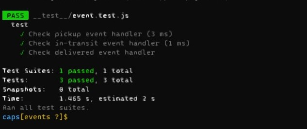
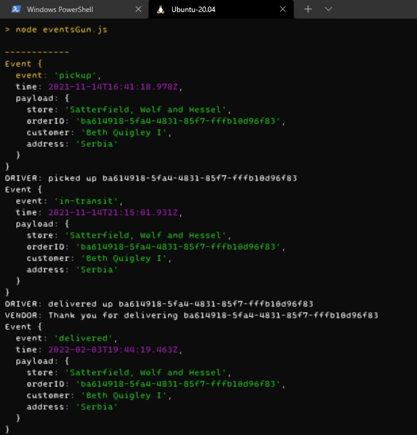
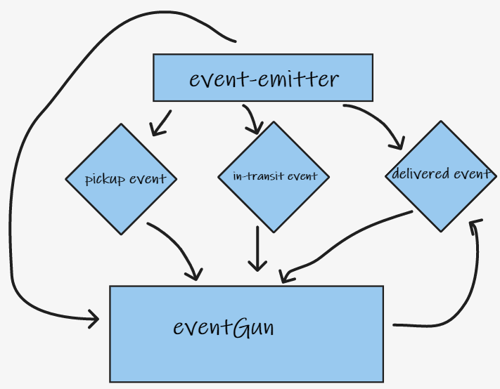

# caps

## description:
- a system of events and handler to log the event of ordering item from store.
## features:
- Faker.js
- Jest
- Events Driven Applications
## Outputs
- 
- 
## UML
- 

## test:
- `npm test`
- `npm start`